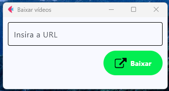

# 🎬 YouTube Downloader

Interface simples e intuitiva para baixar vídeos ou áudios diretamente do YouTube.  
Desenvolvido em **Python**, o projeto combina **Flet** para a interface gráfica e **pytubefix** para gerenciar o download, garantindo compatibilidade com as mudanças recentes do YouTube.

---

## 📂 Estrutura do Projeto

📁 YouTube Downloader/<br>
├── 📁 assets/<br>
│	   └──📸 layout-exemple.png<br>
├── 📁 downloads/<br>
├── 📁 functions/<br>
│     └──📄 method.py<br>
├── 📄 layout.py<br> 
└── README.md<br>


---

## ⚙️ Tecnologias e Bibliotecas Utilizadas

| Biblioteca | Função |
|-------------|--------|
| **flet** | Criação da interface gráfica moderna e responsiva |
| **pytubefix** | Conexão com o YouTube, preparação e download dos vídeos |
| **moviepy** | Conversão dos arquivos baixados (por exemplo, de MP4 para MP3) |
| **win32api / win32con** | Exibição de alertas e mensagens de sucesso/erro no Windows |
| **os** | Manipulação de diretórios e arquivos locais |

---

## 🧠 Como o Projeto Funciona

1. O usuário insere a **URL** do vídeo do YouTube na interface principal.  
2. Ao clicar em **"Baixar"**, é disparada a função `on_click` do botão.  
3. Essa função captura o valor digitado e envia como parâmetro para `download_video()` presente em `function/method.py`.  
4. O método:
   - Estabelece a conexão com o YouTube via `pytubefix`;
   - Localiza e prepara o vídeo para download;
   - Efetua o download (vídeo ou áudio);
   - Converte o formato caso necessário (com `moviepy`);
   - Salva o resultado na pasta `downloads/`;
   - Exibe mensagens de sucesso ou falha usando `win32api`.

---

## 💻 Execução

### 1️⃣ Clonar o repositório:
    ```bash
      git clone https://github.com/seu-usuario/You-Tube-Downloader.git
      cd You-Tube-Downloader
### 2️⃣ Instalar as dependências:
      ``` bash
         pip install flet pytubefix moviepy pywin32
### 3️⃣ Executar o projeto:
      ```bash
      python layout.py

## 🪄 Interface

A interface foi desenvolvida com Flet, proporcionando uma aparência limpa e moderna:

<p align="center">  </p>

## 📦 Futuras Implementações

 () Escolha de resolução de vídeo

 () Baixar arquivos em vídeo


## 🧑‍💻 Autor

Marcelo Pereira Rodrigues

Em constante aprendizado, explorando o poder do Python e criando soluções simples e eficientes.

## 📧 Contato 

Segue meus links para contato: [✉️](https://www.linkedin.com/in/marcelo-pereira-rodrigues/)

